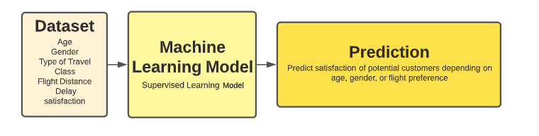

# Final_Project_7

Are loyalty programs a valid strategy for airline companies to overcome post-pandemic hardships?

https://docs.google.com/presentation/d/1k4jHjoYMHhdZKnQShsRYQK2yTnBShRqGOoqXQPvVq5U/edit?usp=sharing

## Selected Topic
Covid-19 has turned the whole world upside down. Many of the strongest, toughest industries have had to rethink their business models and strategies. Governments and companies alike, have come to realize that they cannot keep working the same way as before the pandemic. Time has come to make necessary adjustments to survive and to rebuild what has been affected. 

Travel restrictions and the implications of traveling during Covid-19 times have specially altered the way people use airplanes. Airlines had huge impacts during the pandemic, as well as hotels in touristic destinations. To get a better sense of the magnitude of the pandemic, the International Air Transport Association (IATA) released a publication showing exactly how devastating it was for the overall air transport services. According to IATA, 1.8 billion passengers flew in 2020, a decrease of 60.2% compared to the 4.5 billion who flew in 2019. This represented very important revenue losses; the total industry passenger revenues fell by 69% to $189 billion in 2020, and net losses were $126.4 billion in total. On average, there was a $71.7 loss incurred per passenger in 2020. (Source: https://www.iata.org/en/pressroom/pr/2021-08-03-01/)

Companies have been actively looking for ways to spend their resources effectively and efficiently. With no dollar to spare, they are looking into many alternatives that have the most impact in recovering their operations. Throughout the hospitality and travel industry, many of the companies have turned their sights on loyalty programs to help them accomplish this goal. Many reports and publications on loyalty programs show just how impactful a well-deviced loyalty program can be. According to Invesp (https://www.invespcro.com/blog/customer-loyalty-programs/) 74% of travel customers surveyed have made purchasing decisions based on travel reward programs. When looking at Linchpinseo's publication (https://linchpinseo.com/trends-customer-loyalty-programs/) we see that currently, 80% of a company’s future revenue will come from just 20% of existing clients and that it costs 5% more to acquire a new customer than keep an existing one satisfied and happy. In conclusion, it its harder, and less fruitful, to gain new customers than it is to maintain the ones the company already has. 

The data analytics department is working alongside Mexicana Aviacion to implement a machine learning model that helps them predict whether people purchesing tickets will become loyal customers or not. The purpose, of course, is to aid in resource allocation in order to invest wisely and to tap into the potential that loyalty programs present to travel companies. Thanks to this model, Mexicana Aviacion will understand their clientele better and will have better decision-making insights to help them take care of their loyal customers first and foremost. 

## Importance of selected topic
The tourism industry consists of hospitality, transportation, travel facilitation and information and attractions and entertainment. According to the World Travel & Tourism Counci (WTTC), as a whole, the travel & tourism sector suffered a loss of almost US$4.5 trillion dollars in 2020, with the contribution to GDP dropping by a staggering 49.1% compared to 2019. In 2019, it contributed 10.4% to global GDP; a share which decreased to 5.5% in 2020 due to ongoing restrictions to mobility. The impact of this massive decline in number of travelers goes a long way. In 2020, 62 million jobs were lost, representing a drop of 18.5%, leaving just 272 million employed across the sector globally, compared to 334 million in 2019 (WTTC).

Not only does the economy need an urgent uplift, but so does the job markets all over the world. Economic re-activation has to begin in every single industry. However, the importance of the travel and tourism sector cannot be underrated. (Source:https://wttc.org/Research/Economic-Impact#:~:text=In%202019%2C%20the%20Travel%20%26%20Tourism,to%20334%20million%20in%202019)

## Data sourcing
 For the purpose of this investigation, data was obtained from kaggle.com (https://www.kaggle.com/teejmahal20/airline-passenger-satisfaction?select=test.csv). Kaggle is a crowd-sourced platform created to attract, nurture, train and challenge data scientists from all around the world to solve data science, machine learning and predictive analytics problems. It has over 536,000 active members from 194 countries and it receives close to 150,000 submissions per month. This particular dataset contains an airline passenger satisfaction survey with columns such as Age, Gender, Type of Travel, Flight Distance, among many others.

## Questions to address
As stated previously, companies are actively trying to regain what was lost during the pandemic. Customers and jobs. In order to accomplish this goal, they are looking into several strategies and alternatives that help them gain new customers and maintain the ones already on board. This investigation aims to address the following question: "Are loyalty programs a valid strategy for airline companies to overcome post-pandemic hardships?". 

In order to obtain some knowledge about the main issue at hand, a few other questions were born. First of all, can a machine learning model predict the type of customer (loyal vs disloyal) a ticket purchaser will become in the future? What factors are highly correlated to the decision to become a loyal customer? Secondly, which are the areas of opportunity?; especifically, where during the "buying of a ticket to completing the flight" process does the company lose or gain the client's loyalty? 

## Communication protocols
Roles are assigned to every member of the investigation team. Based on these, coworkers know their particular set of activities and responsiblities and boundaries were set between each position in order to maintain a cohesive and ordered workspace. In order to accomplish an effective workflow, there is a team member assigned to manage any requests or complaints from the rest of the team. If there are any issues to be handled, there will be a 15-min session on Saturdays to work it out. 

During weekdays, the team meeting is designated on Tuesdays and Thursdays from 7:00pm to 10:00pm. During this time, team members can work on their individual activities or brain-storm about general issues met during the investigation. An additional meeting was set on Saturdays in order to review the week's advances and plan for the week ahead. 

The official tool for communicating is Slack. Any and all investigation related topics shall be discussed using the official channels in order to keep track of the team's progress. 

## Data exploration phase of the project 
The investigation began by a general analysis of the tourism and travel industry and how it changed during the course of the pandemic, with the purpose of understading the current situation better. Once that was done, the data analytics team looked for databases that could be used to implement our proposed model and build up the prediction strategy. 

Many databases were compared, looking for data that represented the current industry's situation more precisely. However, we are currently developing our machine-learning model based on the database previously mentioned. 

## Description of the analysis phase of the project
At this point in the investigation, the team is tirelessly working towards achieving the best possible machine-learning model. Many tweaks are being analyzed in order to make our predictions stronger. 

### Database
The dataset contains an airline passenger satisfaction survey, the factors that lead the customer satisfaction for an Airline. The dataset contains 25,976 rows for the test and 103,904 rows for training.

| Column | Data Type | Description |
| ------------- | ------------- |  ------------- |
| **Gender** | VARCHAR(6) | Gender of the passengers (Female/Male)  |
| **Customer_Type** | VARCHAR(32)  | The customer type (Loyal customer/Disloyal customer)  |
| **Age** | INT | The actual age of the passengers |
| **Type_Travel** | VARCHAR(32) | Purpose of the flight of the passengers (Personal Travel/Business Travel) |
| **Class** | VARCHAR(16) | Travel class in the plane of the passengers (Business/Eco/Eco Plus) |
| **Flight_distance** | INT | The flight distance of this journey |
<<<<<<< HEAD
=======
| **Inflight_WiFi_service** | SMALLINT | Satisfaction level of the inflight WiFi service (0:Not Applicable; 1-5) |
| **Departure/Arrival_time** | SMALLINT | Satisfaction level of Departure/Arrival time convenient (1-5) |
| **Ease_Online_booking** | SMALLINT | Satisfaction level of online booking (1-5) |
| **Gate_location** | SMALLINT | Satisfaction level of Gate location (1-5) |
| **Food_and_drink** | SMALLINT | Satisfaction level of Food and drink (1-5) |
| **Online_boarding** | SMALLINT | Satisfaction level of online boarding (1-5) |
| **Seat_comfort** | SMALLINT | Satisfaction level of Seat comfort (1-5) |
| **Inflight_entertainment** | SMALLINT | Satisfaction level of inflight entertainment (1-5) |
| **On_board_service** | SMALLINT | Satisfaction level of On-board service (1-5) |
| **Leg_room_service** | SMALLINT | Satisfaction level of Leg room service (1-5) |
| **Baggage_handling** | SMALLINT | Satisfaction level of baggage handling (1-5) |
| **Check_in_service** | SMALLINT | Satisfaction level of Check-in service (1-5) |
| **Inflight_service** | SMALLINT | Satisfaction level of inflight service (1-5) |
| **Cleanliness** | SMALLINT | Satisfaction level of Cleanliness (1-5) |
| **Departure_Delay** | SMALLINT | Minutes delayed when departure (1-5) |
| **Arrival_Delay** | SMALLINT | Minutes delayed when Arrival (1-5) |
| **Satisfaction** | BOOLEAN | Airline satisfaction level (Satisfaction/neutral or dissatisfaction) |

>>>>>>> 90e10896df947fd61c884d4b21e8b9b3d85e48c9

### Supervised Learning Model
Machine learning is the use of statistical algorithms to perform tasks such as learning from data patterns and making predictions.

Supervised learning is an approach to creating artificial intelligence, where a our algorithm is trained on input data of Airline Passenger Satisfaction,that has been labeled. The model will be trained until it can detect a relationships between the input data and the output labels.

In this project we are determining the satisfaction for a future customer. 

#### Preliminary data preprocessing 
In order to clean and prepar the data for the model, several steps were established. They go as follows:
1. It was first checked for null or empty values. If so, they were dropped from our dataframe.
2. Secondly, every column was defined as either numerical or categorical. 
3. Identifying unique values in every column.   
4. Based on those unique values, categorical columns were encoded to transform them into numerical values.
5. Bins were created for several numerical columns in order to better use data for analysis.
6. Several columns were dropped because they were identifiers of some sort. 
7. Data was then sent to Postgresql using Amazon Web Services. 

#### Preliminary feature engineering and preliminary feature selection
Based on available data, the decision was made to keep every column except for any column that worked as an identifier. This was decided because the rest of the columns referred to customer satisfaction and flight characteristics. Bottom line, all the rest of available columns have an impact on loyalty, and therefore, were considered to be important for the analysis.  

#### Splitting data into training and testing sets
The defined target was Customer type, where only two options are available: loyal or disloyal.
On the other hand, our features can be found on the Database section of this document.  

The data's split for the purpose of this model is as follows: 75% dedicated to training the model and 25% dedicated to testing the model. This decision was made based on the fact that the library train_test_split uses those arguments by default. 

#### Explanation of model choice, including limitations and benefits
The model chosen was logistic regression. These models are used to analyze data and, mathematically determining the probability of new samples belonging to a class. There are only two possible answers.

For this investigation,  the objective was to predict whether new purchasing clients will be loyal or disloyal. The purpose of predicting this outcome is to create better loyalty programs and to dedicate resources to the right customers. 

After creating the model, it was confirmed that this particular data could be correctly analyzed using this strategy.

### Technologies

**Jupyter Notebook** -  https://jupyter.org/

An open source and practical platform that allows coding in multiple languajes and it is able to include text, images and so on, through the execution of the code in the kernel. 
This source will help us to manipulate the data, in uses such as: cleaning, conversion,modeling the data, among other functions. 

**PostgreSQL** - https://www.postgresql.org/

An open source relational database management system. It will allow us to define, create, and control the database.

**RStudio** - https://www.rstudio.com/

An integrated development environment or add on of R, that indeed takes the R software and add it to a graphical interface.  
It will help us to plot, debugg, and manage our data, mainly to find correlation between our inputs from the database. 

**Tableau** - https://www.tableau.com

Visualization software of interactive data that will help us to show the results in a better comprehensive way. 

### Dashboard
Tableau is a visual analytics engine that makes it easier to create interactive visual analytics in the form of dashboards.
We choose Tableau to create our dashboard because is a powerful tool with data visualization capabilities and data can be analyzed very quickly. Tableau allows us to create workbooks with all the data to guide us in our exploration.

The integration to work with raw data was definitively a key functionality so we can import our database and work directly in different worksheets. Adding datasets was very simple, we create a CSV file from the current database located in AWS. When we process all the dashboards it was easy to share the story and collaborate with the team.

#### Description of interactive element(s)
One of the most interesting tools that Tableau provides is interactivity. Some of the graphs created can be modified by the viewer using several filters in order to make a deeper analysis. The tableau dashboard can be viewed publicly here: https://public.tableau.com/views/SatisfactionFinal/PassengerSatisfaction?:language=en-US&:display_count=n&:origin=viz_share_link
